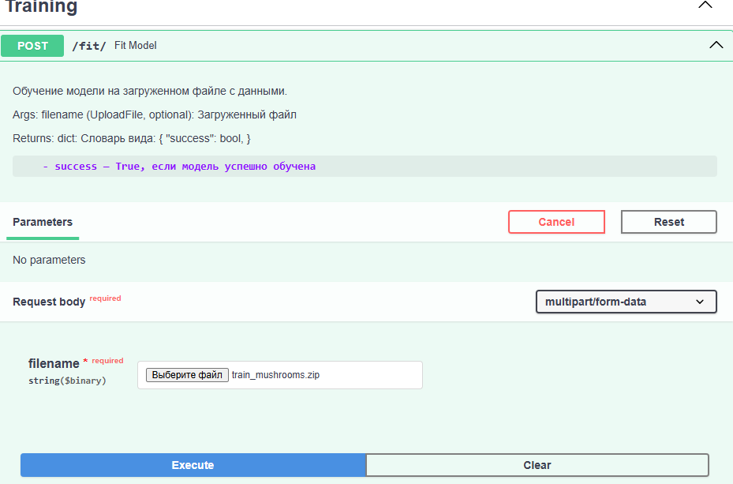
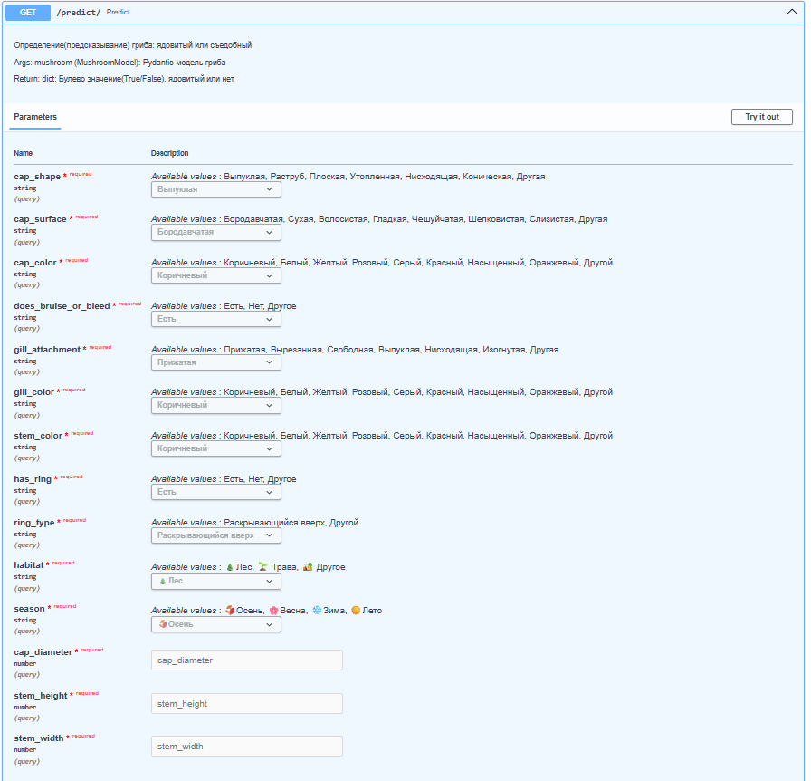
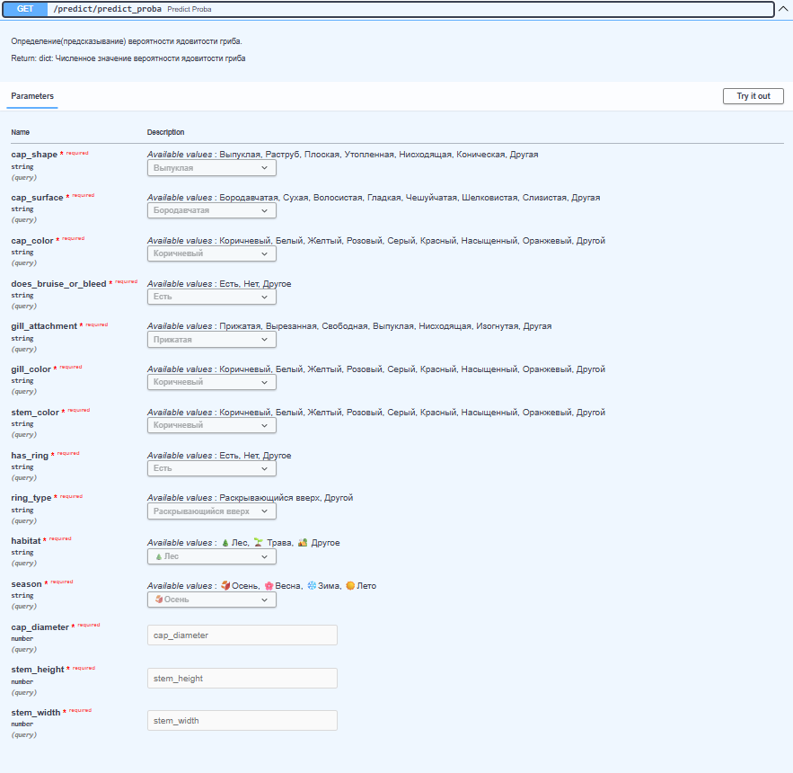
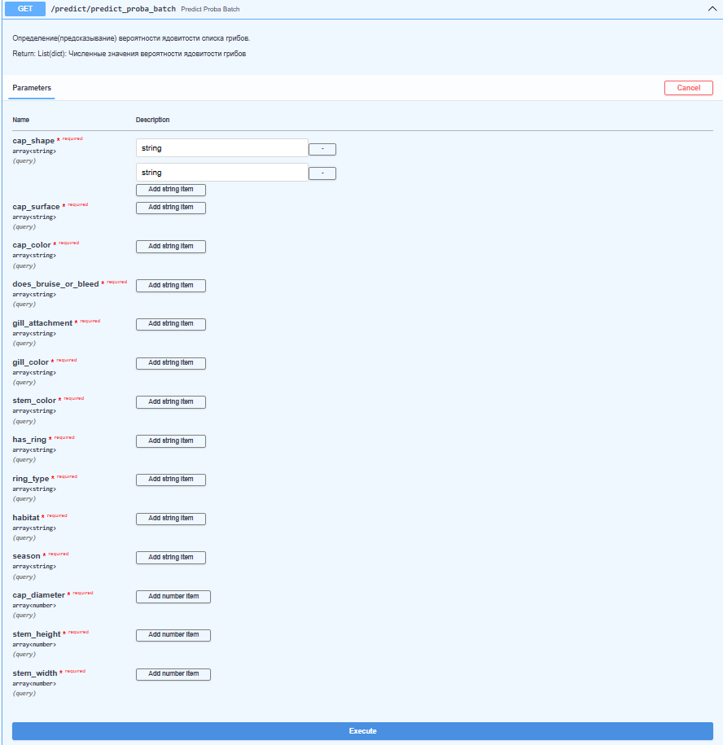
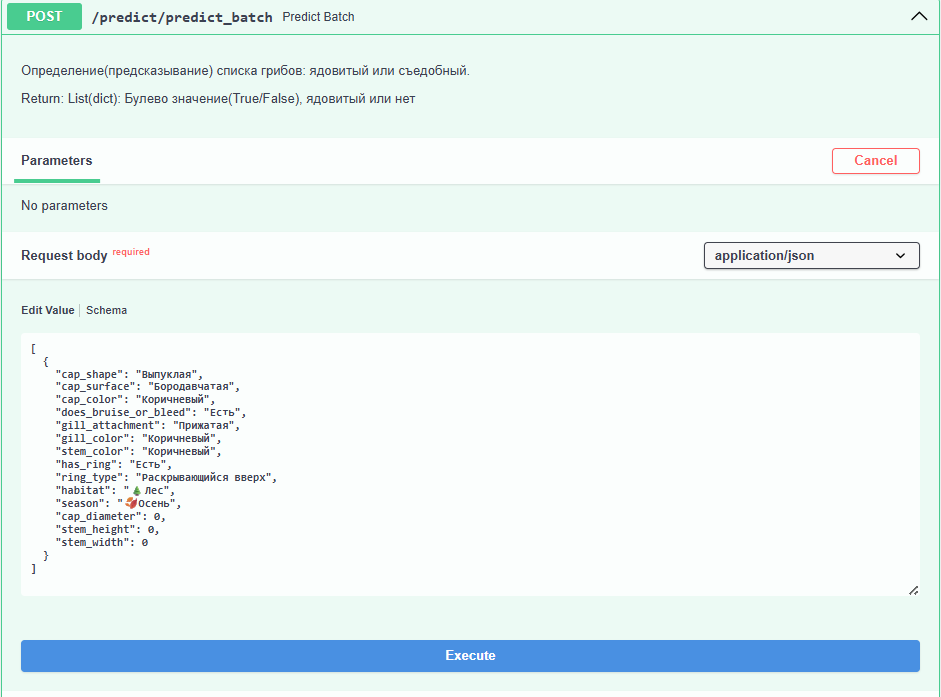
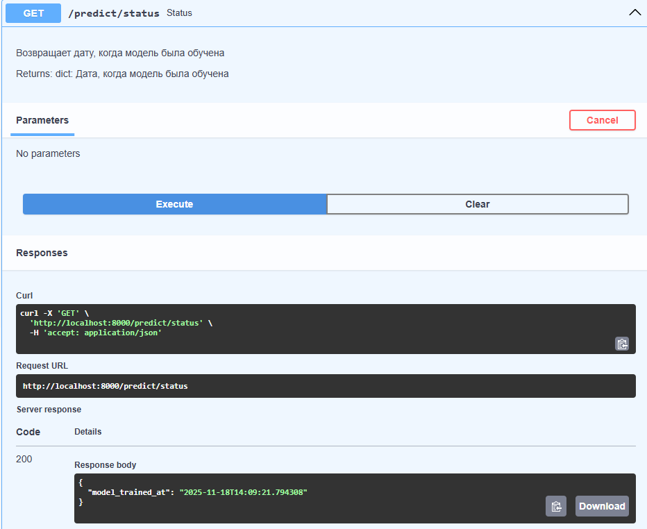

< Реализация сервиса на FastAPI с потроенной моделью машинного обучения: Классификация грибов на ядовитость >

**Содержание**

- [Установка](#установка)
- [Выполнение ](#выполнение)
- [Использование](#использование)
- [Используемый стек](#используемый_стек)
- [Автор](#автор)


## Установка

Чтобы запустить проект, выполните следующие команды в командной строке:

Клонируем репозиторий (желательно при помощи SSH-ключа) и переходим в него:
```sh
git clone git@github.com:ade-usa702/classification_of_mushrooms.git
```
```sh
cd classification_of_mushrooms
```

* На macOS и Linux - ```python3```:
Создаем виртуальное окружение:
```sh
    python -m venv venv
```

Активируем виртуальное окружение:
```sh
    venv\Scripts\activate
```
на macOS и Linux:
```sh
    source venv/bin/activate
```
- в терминале появится (venv) слева


## Выполнение

Чтобы запустить сервис, ввыполните следующие шаги:

1. В командной строке введите: (для сборки Docker-образ)
```sh
docker build -t fastapi-service .
```

2. Для запуска контейнера:
```sh
docker run -d -p 8000:8000 fastapi-service
```

## Использование
Реализовано 6 эндпоинтов с GET- и POST- запросами, которые можно увидеть, перейдя по: http://localhost:8000/docs

! Прежде чем дергать predict-ы, создайте .pkl файл при помощи POST-запроса
1. POST-запрос fit


2. GET-запрос predict

Предсказывает ядовитый гриб или нет 

3. GET-запрос predict_proba

Предсказывает вероятность ядовитости гриба

4. GET-запрос predict_proba_batch

Предсказывает вероятность ядовитости грибов (на вход поступает список)

4. POST-запрос predict_batch

Предсказывает ядовитый гриб или нет (на вход поступает список)

6. GET-запрос status

Возвращает дату, когда модель была обучена

* Дополнительно:
- в директории test находятся тесты на все эндпоинты;
- в директории client находятся запросы всех перечисленных выше типов на сервер;

## Используемый стек

- [Python](https://www.python.org/): 
- [Docker](https://www.docker.com/) 

## Автор

< Автор > - [@AuthorTelegram](https://t.me/Ade702) - @Ade702